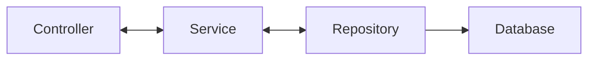

- [ ] add the additional dependencies: search JPA, mySQL

- [ ] update [application.properties](./src/main/resources/application.properties)
- [ ] update [pom.xml](./pom.xml)

- [ ] create [SongController.java](./src/main/java/co/tylermaxwell/songscrud/controllers/SongController.java)
- [ ] create [SongApiController.java](./src/main/java/co/tylermaxwell/songscrud/controllers/SongApiController.java)

## layered model

- [ ] [Song.java](./src/main/java/co/tylermaxwell/songscrud/models/Song.java)
- [ ] [SongService.java](./src/main/java/co/tylermaxwell/songscrud/services/SongService.java)
- [ ] [SongRepository.java](./src/main/java/co/tylermaxwell/songscrud/repositories/SongRepository.java)

- [ ] views [index.jsp](./src/main/webapp/WEB-INF/index.jsp)
