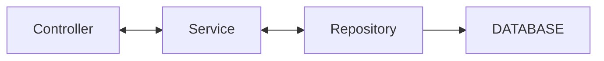

- [ ] update [application.properties](./src/main/resources/application.properties)
- [ ] update [pom.xml](./pom.xml)
- [ ] create [SongController.java](./src/main/java/co/tylermaxwell/songs/controllers/SongController.java)
- [ ] create [SongController.java](./src/main/java/co/tylermaxwell/songs/controllers/SongApiController.java)

- [ ] create [SongService.java](./src/main/java/co/tylermaxwell/songs/services/SongService.java)
- [ ] create [SongRepository.java](./src/main/java/co/tylermaxwell/songs/repositories/SongRepository.java)
- [ ] create [Song.java](./src/main/java/co/tylermaxwell/songs/models/Song.java)

- [ ] create [views](./src/main/webapp/WEB-INF/index.jsp) 